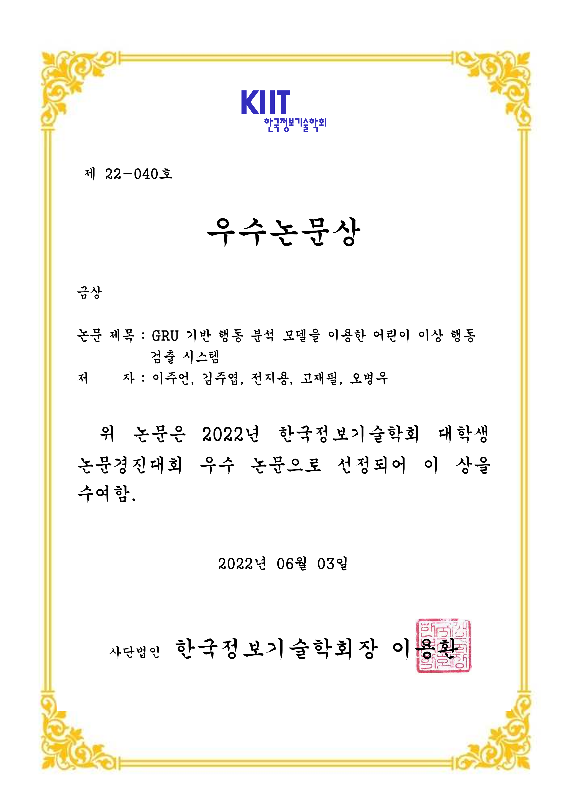

# GRU 기반 행동 분석 모델을 이용한 어린이 이상 행동 검출 시스템

## Information
<table>
    <th>
        
    </th>
    <th>
        
    </th>
    <tr>
        <td colspan=2>
            <li><a src="https://www.dbpia.co.kr/journal/voisDetail?voisId=VOIS00692420">DB pia - 한국정보기술학회 2022년도 하계종합학술대회 및 대학생논문경진대회</a></li>
            <li><a src="https://www.dbpia.co.kr/journal/articleDetail?nodeId=NODE11082631">DB pia - GRU 기반 행동 분석 모델을 이용한 어린이 이상 행동 검출 시스템</a></li>
        </td>
    </tr>
</table>

## Quick Start Examples
<details>
<summary>Preprocessing</summary>
<div markdown="1">

```
$ python preprocess.py -v ./원본/싸움/*/*/*.mp4 -l ./싸움/*/*/*.xml -s new_datasets/train/2 ../final_datasets/train/2 -f features_train_normal
```
</div>
</details>
<details>
<summary>Train</summary>
<div markdown="1">

```
$ python train.py -d ../datasets
```
</div>
</details>
<details>
<summary>Inference</summary>
<div markdown="1">

```
$ python inference.py 
```
</div>
</details>

